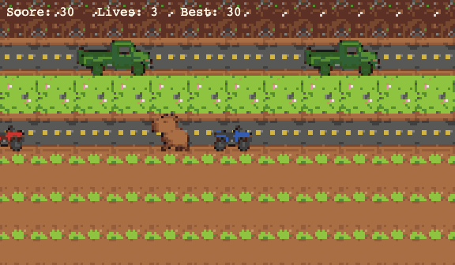

# Capybara Crossing

A retro arcade tutorial: hop a pixel-art capybara across jungle roads to a mud spa. The **shipped game is three files** (`index.html`, `style.css`, `game.js`) with no bundler and no runtime npm dependencies. Open `index.html` in a browser.



npm is **dev-only** (unit tests, Playwright, a static file server).

## Play

- **Move:** arrow keys (one tile per press)
- **Score:** +10 only when you hop **Up** onto a new farthest-north row for this life (re-climbing the same row after going down does not score again); +50 more when you enter the spa
- **Lives:** 3. Overlap with an ATV or truck costs a life and respawns at the start
- **Difficulty:** each spa clear makes traffic 10% faster; **Enter** / **Space** after Game Over resets speed to normal
- **Best:** HUD shows Best; it persists in `localStorage` across reloads
- **Game Over:** lives hit 0. **Enter** or **Space** starts a new run (Best is kept)

## Run the game

No install required:

```bash
open index.html
```

Or any modern browser: File → Open → `index.html`.

Optional local HTTP (same files, useful if `file://` atlas loading is awkward):

```bash
npm install
npm run serve
```

Then open [http://127.0.0.1:8765/index.html](http://127.0.0.1:8765/index.html).

Add `?freeze=1` to pause traffic (used by the visual snapshot test).

## Development setup

Requires **Node.js 22+** (see `.nvmrc`).

```bash
npm install
```

That also copies `.githooks/pre-commit` into `.git/hooks`, so commits run `npm test` (coverage must stay ≥80% line, function, and branch on `game.js` / `src/**`).

For the Playwright visual test, install a Chromium browser once:

```bash
npx playwright install chromium
```

### Tests

| Command | What it does |
|---|---|
| `npm test` | Node unit tests + coverage gate (pre-commit) |
| `npm run test:watch` | Re-run unit tests on file change |
| `npm run test:e2e` | Playwright canvas snapshot (frozen spawn) |
| `npm run test:e2e:update` | Rewrite the committed canvas baseline |

Put new game logic behind functions that tests can import from `game.js`. Keep canvas/DOM glue thin.

## Layout

```
index.html          # boot
style.css           # crisp pixel canvas
game.js             # loop, hop, traffic, hits, spa, Game Over
assets/sprites/     # 128×128 atlas + frame map
tests/*.test.mjs    # unit tests
tests/e2e/          # Playwright visual gate
openspec/           # specs and archived changes
```

Gameplay behavior is specified in `Capybara Crossing.md`. Remaining optional items there (timer, audio) stay parked until requested.
